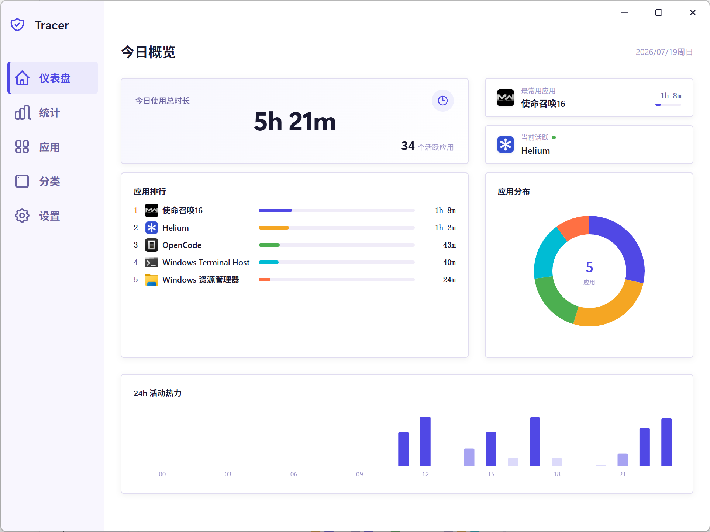
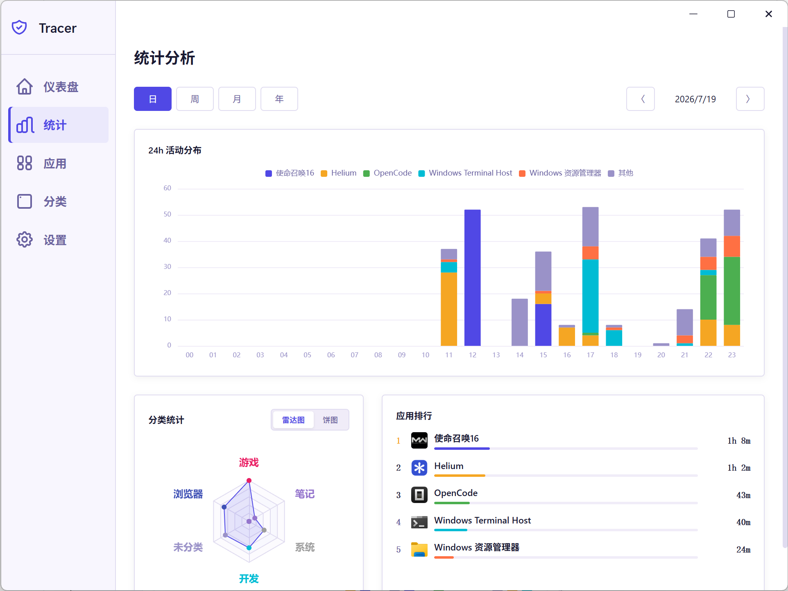
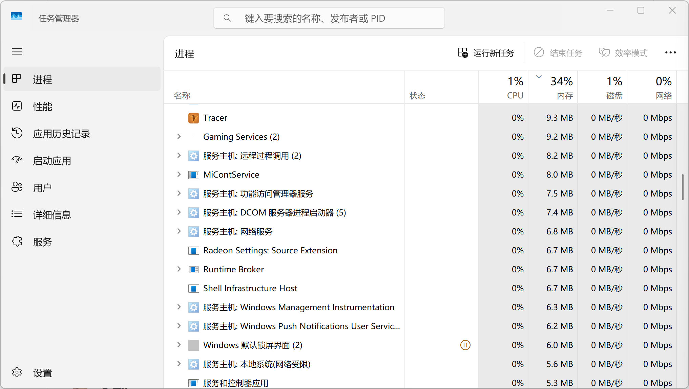

# 🐾 Tracer

> 中文名：踪

> 你的一天，值得被看见。

有没有这种感觉：一天下来好像忙了很多，又好像什么都没干？Tracer 来替你记账——时间的账。

自动记录软件使用时长，不用打卡、不用手动记。打开看看，就知道时间都流向了哪里。工作只是换取薪酬，了解时间花在哪，才是真正的赚到 😏

由 Rust + Tauri 驱动，极致的性能表现，你的时间数据，只属于你。

## 🖼️ 界面预览

## ✨ 功能一览

- 📋 **应用统计** — 自动记录每个软件的使用时长，按天、周、月汇总，谁占用了你的时间，一目了然
- ⏱️ **自动追踪** — 开机即启，后台静默运行，不打扰、不折腾，打开就能看到完整记录
- 🔮 **时光透视** — 雷达图、柱状图、饼图多维度呈现，一眼看穿你的时间都流向了哪里
- 🍃 **静默之力** — 日常使用内存不到 10MB，CPU 占用率接近 0，存在感约等于无

## 🛠️ 技术栈

| 层级   | 技术                                   |
| ---- | ------------------------------------ |
| 前端   | SvelteKit + TypeScript + TailwindCSS |
| 桌面框架 | Tauri 2.x                            |
| 后端   | Rust                                 |
| 存储   | SQLite                               |

## 📦 下载

从 [Releases](https://github.com/tuokun/Tracer/releases) 下载最新安装包即可使用。

## 🔒 隐私

Tracer 完全离线运行。所有数据存储在本地 SQLite 数据库中，不联网、不上传、不追踪。你的时间数据，只属于你。

> 受 [Tai](https://github.com/Planshit/Tai) 启发而诞生，致敬原作者的创意与开源精神。

## License

MIT
