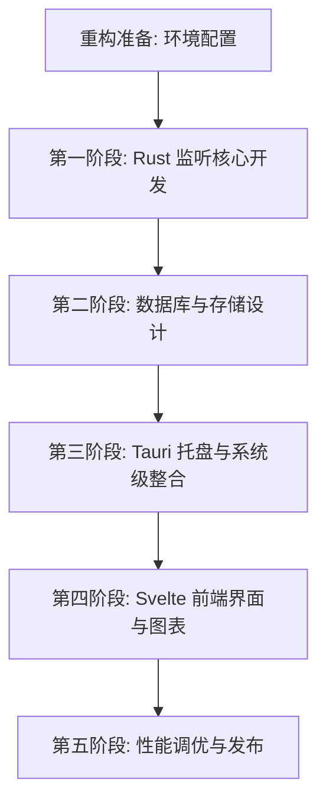

# Tai 极致性能重构设计方案 (Rust + Svelte + Tauri)

本项目旨在通过使用系统级编程语言 **Rust** 以及超轻量 Web 框架 **Svelte**，彻底重构原版基于 C# (WPF) + Entity Framework 的 Windows 时间统计应用 **Tai**。

重构的核心目标是：**在保留最核心功能的前提下，实现极致的性能提升、极低的后台资源占用（后台静默内存目标 < 10MB、上限 < 50MB，CPU 接近 0%），并提供现代化、高颜值的毛玻璃暗黑 UI。**

---

## 一、 技术栈选型与架构设计

### 1. 后端架构 (Rust Core)
选择 Rust 作为底层核心，以获取无垃圾回收（No GC）的确定性性能和极低的内存占用。
*   **异步运行时:** `tokio`（用于异步任务调度，如计时器与窗口事件回调）。
*   **本地数据库:** `rusqlite`（直接调用 SQLite 的 C 语言原生接口，无重量级 ORM 开销，读写性能在微秒级）。
*   **系统底层接口:** `windows` 库（微软官方维护的 Rust Win32 API 绑定，用于窗口钩子、音频检测和注册表操作）。
*   **网络通信:** `tokio-tungstenite`（轻量级异步 WebSocket 协议栈，用于接收浏览器插件数据）。

### 2. 跨端容器 (Tauri v2)
Tauri v2 是当前最轻量的桌面端 Web 容器。
*   **WebView 进程销毁机制:** 默认情况下，应用以系统托盘（System Tray）形式常驻后台。当用户双击托盘打开 UI 时，Tauri 启动 Webview2 进程（内存约 30-60MB）；当用户关闭窗口时，**完全销毁 WebView 进程**，释放所有前端占用的内存，后台只保留纯 Rust 线程（内存目标 < 10MB、上限 < 50MB）。
*   **开机自启:** 通过 Rust 直接操作 Windows 注册表实现，无需额外后台进程。

### 3. 前端架构 (Svelte + TS + Vite + TailwindCSS)
*   **Svelte 5 / TypeScript:** Svelte 没有虚拟 DOM（Virtual DOM），它在编译时直接将组件转换为极简的、针对性修改 DOM 的原生 JavaScript，运行速度极快，首屏加载接近瞬间完成，且 JS 执行内存极小。
*   **ECharts:** 用于绘制高性能、交互流畅的时间统计图表（饼图、趋势折线图、时段热力图）。

---

## 二、 重新设计的数据库 Schema (极致优化)

对齐 Tai 的聚合存储模型——不存逐段明细，仅按「小时桶」与「天桶」累加时长，配合 `apps.total_time` 累计字段，数据量天然极小、查询飞快。详见 `方案评审记录.md` 一·1。

```sql
-- 1. 软件信息表
CREATE TABLE IF NOT EXISTS apps (
    id INTEGER PRIMARY KEY AUTOINCREMENT,
    process_name TEXT UNIQUE NOT NULL,      -- 进程名 (如: chrome.exe)
    display_name TEXT,                      -- 软件描述/显示名 (如: Google Chrome)
    executable_path TEXT,                   -- 可执行文件绝对路径
    category_id INTEGER DEFAULT 0,          -- 分类ID
    icon_path TEXT,                         -- 本地提取并缓存的图标路径 (.ico/.png)
    total_time INTEGER DEFAULT 0            -- 累计使用总时长 (秒)
);
CREATE INDEX IF NOT EXISTS idx_apps_process ON apps(process_name);

-- 2. 时段使用日志表 (按小时桶聚合，对齐 Tai HoursLog)
CREATE TABLE IF NOT EXISTS hours_log (
    id INTEGER PRIMARY KEY AUTOINCREMENT,
    app_id INTEGER NOT NULL,
    data_time INTEGER NOT NULL,             -- 所在小时整点时间戳 (Unix, 秒)
    time INTEGER NOT NULL,                  -- 该小时内累计使用时长 (秒, 上限 3600)
    FOREIGN KEY(app_id) REFERENCES apps(id) ON DELETE CASCADE
);
CREATE INDEX IF NOT EXISTS idx_hours_log_time ON hours_log(data_time);
CREATE INDEX IF NOT EXISTS idx_hours_log_app ON hours_log(app_id);

-- 3. 每日使用日志表 (按天桶聚合，对齐 Tai DailyLog)
CREATE TABLE IF NOT EXISTS daily_log (
    id INTEGER PRIMARY KEY AUTOINCREMENT,
    app_id INTEGER NOT NULL,
    date INTEGER NOT NULL,                  -- 日期 (YYYYMMDD)
    time INTEGER NOT NULL,                  -- 当日累计使用时长 (秒, 上限 86400)
    FOREIGN KEY(app_id) REFERENCES apps(id) ON DELETE CASCADE
);
CREATE INDEX IF NOT EXISTS idx_daily_log_date ON daily_log(date);
CREATE INDEX IF NOT EXISTS idx_daily_log_app ON daily_log(app_id);

-- 以下网页相关表为 v2 功能 (浏览器网页统计)，v1 不建表。见方案评审记录.md 二·1。
-- CREATE TABLE IF NOT EXISTS web_sites (
--     id INTEGER PRIMARY KEY AUTOINCREMENT,
--     domain TEXT UNIQUE NOT NULL,
--     display_name TEXT,
--     category_id INTEGER DEFAULT 0,
--     icon_path TEXT
-- );
-- CREATE TABLE IF NOT EXISTS web_logs (
--     id INTEGER PRIMARY KEY AUTOINCREMENT,
--     site_id INTEGER NOT NULL,
--     url TEXT NOT NULL,
--     title TEXT,
--     start_time INTEGER NOT NULL,
--     duration INTEGER NOT NULL,
--     FOREIGN KEY(site_id) REFERENCES web_sites(id) ON DELETE CASCADE
-- );

-- 4. 分类表
CREATE TABLE IF NOT EXISTS categories (
    id INTEGER PRIMARY KEY AUTOINCREMENT,
    name TEXT UNIQUE NOT NULL,              -- 分类名称 (如: 开发、娱乐、办公)
    color TEXT,                             -- 分类代表颜色 (HEX, 如: #FF5733)
    rules TEXT                              -- 自动分类规则 (glob 通配符 JSON，匹配 path/process_name/display_name)
);

-- 5. Schema 版本表 (迁移用，见方案评审记录.md 一·9)
CREATE TABLE IF NOT EXISTS schema_version (
    version INTEGER PRIMARY KEY
);

-- 6. 应用配置表 (key-value；启动载入内存缓存，热路径读内存)
CREATE TABLE IF NOT EXISTS config (
    key TEXT PRIMARY KEY,
    value TEXT
);
```

**写入策略（flush）**：事件驱动 + 可配置周期兜底（默认 15 分钟），崩溃最多丢 15 分钟；窗口切换或兜底触发时，把当前段时长按小时/天切分后 upsert 进 `hours_log`/`daily_log`，并累加 `apps.total_time`（单事务）。详见 `方案评审记录.md` 一·1。

**SQLite 调优**：建库时执行 `PRAGMA journal_mode=WAL;` 与 `PRAGMA synchronous=NORMAL;`，写延迟降至微秒级且不阻塞读；flush 由计时 owner task 处理（见 §3.4），DB 写在 task 内同步完成。

**数据保留**：`hours_log`/`daily_log` 永久保留、不主动清理（一年几千~几万行，体积/查询均无压力）。

**配置与迁移**：应用设置（flush 间隔/idle 阈值/开机自启等）存于同库 `config` 表（key-value），启动载入内存缓存、热路径读内存；分类规则存于 `categories.rules`（glob）。Schema 升级经 `schema_version` 表迁移。详见 `方案评审记录.md` 一·9。

---

## 三、 核心功能的技术实现细节

### 1. 窗口焦点监听与进程解析 (Active Window Tracking)
*   **Win32 钩子注册:**
    在 Rust 中使用 `windows::Win32::UI::WindowsAndMessaging::SetWinEventHook` 监听 `EVENT_SYSTEM_FOREGROUND` (0x0003) 事件。当活动窗口发生改变时，触发回调函数。
*   **获取窗口所属进程:**
    1. 通过回调传入的窗口句柄 `HWND`，调用 `GetWindowThreadProcessId` 获取进程 PID。
    2. 使用 `OpenProcess`（申请 `PROCESS_QUERY_LIMITED_INFORMATION` 权限）获取进程句柄。
    3. 调用 `QueryFullProcessImageNameW` 获取该进程的完整可执行文件路径（如 `C:\Program Files\Google\Chrome\Application\chrome.exe`），并从中提取进程名。
*   **UWP (通用 Windows 平台) 应用特殊处理:**
    UWP 应用的活动窗口句柄通常隶属于 `ApplicationFrameHost.exe`，这会导致统计出来的进程全部是 `ApplicationFrameHost`。
    *   *解决方法:* 当检测到活动进程为 `ApplicationFrameHost.exe` 时，调用 `EnumChildWindows` 遍历其子窗口，通过子窗口的 PID 找到真正的 UWP 业务进程（如 `Microsoft.Windows.Photos.exe`）。

### 2. 网页浏览监测 (WebSocket 接收端)

> ⏳ **v2 功能，v1 不实现。** 见 `方案评审记录.md` 二·1。以下为 v2 设计参考。

*   **本地服务:**
    Rust 后台使用 `tokio-tungstenite` 启动一个轻量级 WebSocket 服务，监听 `127.0.0.1:8908/TaiWebSentry`。
*   **协议数据格式:**
    浏览器插件（Chrome / Edge / Firefox 扩展）在用户切换 Tab 或网页活跃时，向该 WebSocket 发送 JSON 数据：
    ```json
    {
      "url": "https://github.com/Planshit/Tai",
      "title": "Planshit/Tai: 在 Windows 上统计软件使用时长...",
      "duration": 1,
      "activeDateTime": 1719759600
    }
    ```
    Rust 后台解析该 JSON，提取出域名（如 `github.com`），并将记录存入 `web_sites` 和 `web_logs` 表中。

### 3. 智能休眠判定算法 (Sleep & Inactivity Detection)
为了防止用户离开电脑时软件继续计时，重构版将实现高精度的“人机交互空闲检测”：
*   **输入检测 (GetLastInputInfo，flush 时判定):**
    不使用全局低级键盘/鼠标钩子（会轻微增加系统延迟），也不开高频轮询。改为在每次 flush（窗口切换或周期兜底触发）时调用一次 `GetLastInputInfo`，取系统级“最后输入时刻”，`idle_ms = GetTickCount64() - lastInput`，鼠标与键盘均计入、无状态、无分配。**判定阈值与 flush 间隔联动**（同一可配置值，默认 15 分钟）：flush 时若 `idle_ms ≥ 阈值` 且无音频播放，则当前这一段**整段丢弃不写库**；否则正常写入。曾考虑按 `idle_ms` 精确裁剪段尾（可免费保住段内真实使用、严格更优），用户评估后选择「整段丢弃」以保持简单（见 `方案评审记录.md` 一·5）。
*   **媒体播放防误判 (WASAPI 豁免):**
    flush 判定休眠前先查音频：若正在播放声音，则**跳过整段丢弃、正常写入**，避免看视频/听歌（鼠标键盘不动但人在用）被误判。
    *   *实现方案:* 调用 Windows 的 **WASAPI (Windows Audio Session API)**。通过 `IMMDeviceEnumerator` 获取默认音频输出设备，激活 `IAudioMeterInformation` 接口，调用 `GetPeakValue()`；峰值大于 `1E-08` 即视为“正在播放”。
*   **系统待机/休眠监听:**
    在 Tauri 的窗口消息循环或后台事件中，监听 `WM_POWERBROADCAST` 消息。当收到 `PBT_APMSUSPEND`（系统准备挂起）时，立即将当前正在计时的应用时长写入数据库，并暂停计时；收到 `PBT_APMRESUMEAUTOMATIC`（系统自动唤醒）时，恢复计时。

### 4. 计时与写入的线程模型

为消除“窗口切换回调”与“周期兜底 flush”之间的竞态，采用**单 owner task + mpsc channel** 模型（详见 `方案评审记录.md` 一·6）：

*   **Win32 hook 线程**：跑 `GetMessage` 消息循环、持有 `SetWinEventHook`。回调在此触发，但它**不碰任何计时状态**，仅解析当前窗口的 PID/进程名/路径，把事件投递进 channel。
*   **Owner task（单）**：独占 `_startTime`/`_appDuration`/`current_app` 与 DB 连接，是**唯一写者**。从 channel 串行处理事件——`ForegroundChanged(app)`、`FlushTick`（周期兜底）、`PowerSuspend`/`PowerResume`。
*   **无锁**：跨线程零共享可变状态，切换与 flush 天然排队；DB 写在 task 内同步执行（WAL 微秒级，无需额外 writer task）。

### 5. 应用分类

*   **求值时机**：app 首次入库时跑一次分类规则，结果缓存进 `apps.category_id`；之后计时/切换**不再**跑规则。仅当用户编辑规则时，对“未手动指派”的 app 重跑一次（历史 app 的补分类靠此）。
*   **规则语法**：glob 通配符（`*`/`?`），匹配 `executable_path` / `process_name` / `display_name` 三字段。
*   **优先级**：手动指派 > 自动规则，手动设定永不被规则覆盖。
*   **默认集**：不预置，从空开始（详见 `方案评审记录.md` 一·7）。

---

## 四、 前端 UI 界面设计与交互规范

前端界面采用极致现代化的暗黑毛玻璃（Glassmorphism）视觉风格，并与 Windows 11 的设计语言保持一致。

### 1. 视觉效果与主题
*   **毛玻璃背景:** 使用 Windows 的 **Mica (云母)** 或 **Acrylic (亚克力)** 材质作为窗口背景（通过配置 Tauri 的窗口属性及调用 `window-vibrancy` 库实现）。
*   **色彩搭配:** 主色调采用深邃暗黑（如 `#0F0F12`、`#1A1A24`），卡片背景采用半透明白色（`rgba(255, 255, 255, 0.05)`），搭配 1 像素的极细边框（`rgba(255, 255, 255, 0.08)`）和柔和阴影。

### 2. 页面布局与图表 (Svelte 仪表盘)
*   **Sidebar (左侧导航栏):**
    极简图标导航：仪表盘（Dashboard）、软件详情（Apps）、网站详情（Websites）、分类设置（Categories）。
*   **Dashboard (主仪表盘):**
    *   *顶部卡片:* 今日总使用时长、最长使用应用、休眠总时长。
    *   *中部图表:*
        *   **软件使用分布 (ECharts 环形图):** 展示今日使用时间最长的 5 个软件及其他软件占比，支持悬浮高亮与点击下钻（点击查看单个软件的 24 小时时间分布）。
        *   **网站浏览分布 (ECharts 环形图):** ⏳ v2（依赖网页统计）。展示今日浏览时间最长的 5 个网站域名占比。
    *   *底部列表:*
        *   今日活跃时间段热力图（展示 0点 - 24点 每小时的活跃度）。
        *   软件使用排行详细列表（带应用图标、进程名、使用时长和百分比进度条）。

### 3. 前后端数据通路 (IPC)

*   **机制**：Tauri `invoke` 命令（Rust `#[tauri::command]`，Svelte 端 `invoke('xxx')`）。v1 无外部消费者，不起额外 HTTP/WebSocket。
*   **命令粒度**：**专用命令**，每个图表/场景一个（`get_today_summary`、`get_app_rank(range)`、`get_hourly_heatmap(date)` 等），类型清晰、好测。
*   **聚合位置**：**SQL 下推**——`GROUP BY` + `SUM` 在 SQLite 完成，Rust 仅透传 + 类型映射；Rust 只在 SQL 表达不了的逻辑时才介入（v1 无此需求）。
*   **更新方式**：**全量拉 + 事件重拉**——UI 打开/切日期时一次性拉当前视图所需数据；后台写库后 `app.emit("data-updated")` 通知前端重拉当前视图，不做增量 diff。

---

## 五、 重构落地路线图 (v1: 5 阶段)



> 浏览器网页统计（原 WebSocket 阶段）已推迟到 v2，见 `方案评审记录.md` 二·1。

### 1. 阶段一：Rust 监听核心开发
*   实现基于 `SetWinEventHook` 的活动窗口监听。
*   实现 UWP 程序的子窗口遍历与真实进程名提取。
*   编写基于 WASAPI 的系统音频播放检测模块。
*   **MVP 验证关卡:** 稳定运行 30 分钟，能打印活动窗口进程名、UWP 提取、WASAPI 峰值，无崩溃、无明显内存增长（见 `方案评审记录.md` 一·3）。

### 2. 阶段二：数据库与存储设计
*   使用 `rusqlite` 建立数据库连接管理器，自动执行建表、建索引及 WAL/synchronous 调优。
*   实现 flush 策略：事件驱动（窗口切换写）+ 可配置周期兜底（默认 15 分钟），按小时/天切分后 upsert 进 `hours_log`/`daily_log` 并累加 `apps.total_time`。

### 3. 阶段三：Tauri 托盘与系统整合
*   配置 Tauri 托盘图标、托盘右键菜单（显示主窗口、开机自启开关、退出）。
*   实现窗口“关闭即隐藏”逻辑，并在隐藏时彻底销毁 WebView 渲染进程。

### 4. 阶段四：Svelte 前端界面
*   使用 Svelte 5 + TypeScript 构建极简响应式状态管理。
*   使用 TailwindCSS 快速实现现代暗黑风格的毛玻璃卡片式布局。
*   引入 ECharts，编写自适应的环形图和时间热力图组件。

### 5. 阶段五：性能调优
*   **内存实测验收:** 托盘常驻、无 UI 10 分钟后测 RSS，目标 < 10MB、上限 < 50MB，记录基线（见 `方案评审记录.md` 一·2）。
*   **二进制体积优化:** 在 `Cargo.toml` 中配置 `panic = "abort"`、`lto = true` 以及 `opt-level = "z"`，将最终生成的后台安装包体积降到最低。
